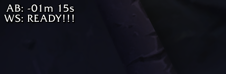

# bg-alert-classic

A client/server tool to continuously capture a specific area of the screen containing Classic WoW BG timers for OCR analysis and alerting.

## WeakAura

[Classic BG Timer OCR](https://wago.io/LbpCpx26A)

A custom WeakAura manages timer display and formatting within WoW which is then analyzed by screen capture by the client tool.

## cli

A Windows Go client to screenshot an area of the screen and
- save as png
- run OCR analysis for battleground timers
- post message to discord channel via webhook
- run once or continually in daemon mode

```bash
# starts both server and client containers in development
# specify server|client service name to control individually
docker-compose up -d

# attach terminal to container
# or attach via vs code remote container to install extensions
docker-compose exec client bash

# build executable inside container
# client.exe output to client folder
./build_client_windows.sh
```

## server

node.js express server providing the OCR capabilities via a single POST endpoint.

Use [tesseract.js](https://github.com/naptha/tesseract.js) to analyze screenshots of WoW Classic WeakAuras showing active battleground timers.

WeakAura examples:




When one bg is ready for entry other active timers pause. Other timers will show the time already waited as a negative value rather than the expected time remaining, as shown in the second example screenshot.

```bash
# starts both server and client containers in development
# specify server|client service name to control individually
docker-compose up -d

# enter container to run one-off script or start express server
docker-compose exec server bash
```

### One-off

```bash
# node ocr.js <imagename>

node ocr.js testdata/test2.png
```

Results

```json
[
  {
    "bg": "AB",
    "hours": undefined,
    "minutes": "-01",
    "seconds": "15",
    "ready": false
  },
  {
    "bg": "WS",
    "hours": undefined,
    "minutes": undefined,
    "seconds": undefined,
    "ready": true
  }
]
```

### Express API Server

```bash
# start the server and reload on changes via nodemon
npm start

# analyze an image
curl -F image=@server/testdata/test.png http://localhost:3003
```

Response

```json
[
  { "bg": "AB", "minutes": "04", "seconds": "21", "ready": false },
  { "bg": "AV", "hours": "01", "minutes": "59", "ready": false },
  { "bg": "WS", "minutes": "01", "seconds": "13", "ready": false }
]
```
