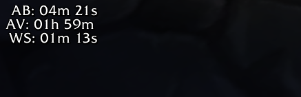
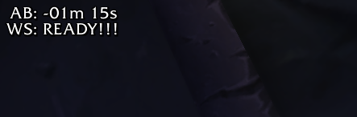

# Experimental WoW Classic Battleground Timer OCR

Use `tesseract.js` to analyze screenshots of WoW Classic WeakAuras showing active battleground timers.

WeakAura examples:




When one bg is ready for entry other active timers pause. Other timers will show the time already waited as a negative value rather than the expected time remaining, as shown in the second example screenshot.

## Usage

```bash
# setup dev container
docker-compose up -d

# enter container to run one-off script or start express server
docker-compose exec -it server bash
```

### One-off

```bash
# node ocr.js <imagename>

node ocr.js testdata/test2.png
```

Results

```json
[
  {
    "bg": "AB",
    "hours": undefined,
    "minutes": "-01",
    "seconds": "15",
    "ready": false
  },
  {
    "bg": "WS",
    "hours": undefined,
    "minutes": undefined,
    "seconds": undefined,
    "ready": true
  }
]
```

### Express API Server

```bash
# start the server and reload on changes via nodemon
npm start

# analyze an image
curl -F image=@/path/to/image.png http://localhost:3003
```

Response

```json
[
  { "bg": "AB", "minutes": "04", "seconds": "21", "ready": false },
  { "bg": "AV", "hours": "01", "minutes": "59", "ready": false },
  { "bg": "WS", "minutes": "01", "seconds": "13", "ready": false }
]
```
